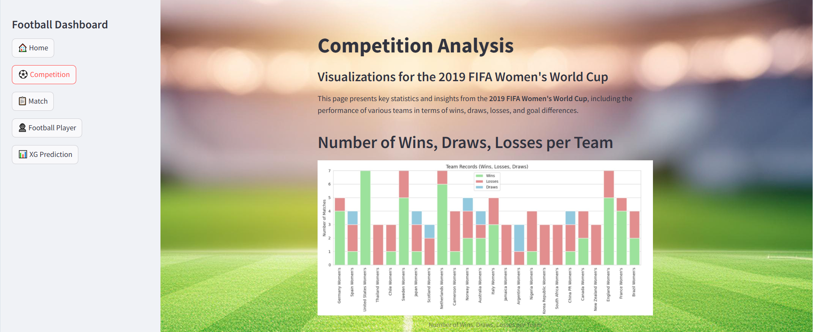
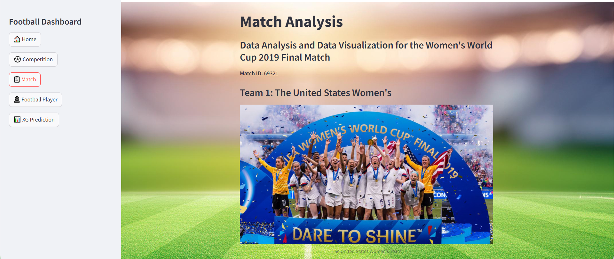
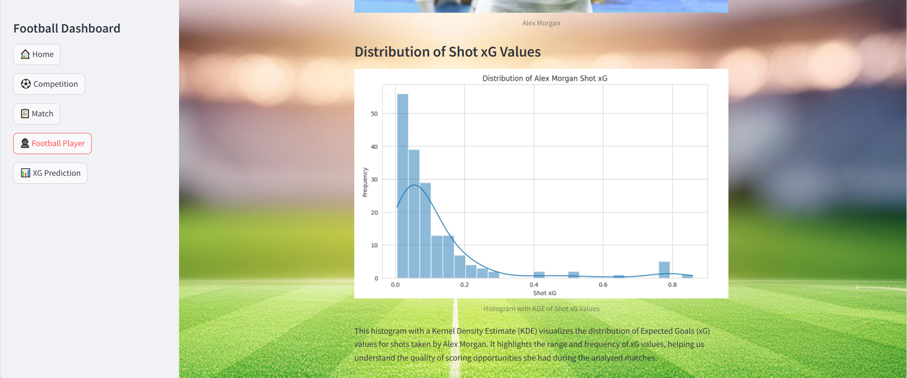

# 📊 Women’s World Cup 2019 – Dashboard & xG Prediction Model


## 🎯 Project Description

This project is the **second stage** of my Women’s World Cup 2019 analysis.
After building the **Google Colab-based visual analysis**, I developed a **Streamlit dashboard** and added an **Expected Goals (xG) prediction model**.

The goal is to give **clear, accessible insights** into team and player performances, and use machine learning to predict the probability of a shot turning into a goal.

📊 **Data Source:** [StatsBomb Open Data](https://statsbomb.com/)


## 🛠 Features

** Dashboard Pages**

* 🏆 **Home**
* 🏆 **Competition Overview** – General tournament stats.
  
* 📋 **Match-Level Analysis** – Key stats from each match.
  
* 👤 **Player Performance** – Passing, shooting, possession metrics.
  
**🤖 xG Prediction Model**

* Gradient Boosting algorithm trained on historical match events.
* Predicts **goal probability** for each shot attempt.

  


## 📚 Libraries Used

* `streamlit` – For the interactive dashboard.
* `pandas`, `numpy` – Data manipulation.
* `matplotlib`, `seaborn` – Data visualization.
* `scikit-learn` – Machine learning model training.


## ⚙️ Execution

**1 Clone the project**

```bash
git clone https://github.com/nadammar/WomensWC2019-Dashboard.git
cd WomensWC2019-Dashboard
```

**2 Run the app on a specific port** (example: 8501)

```bash
streamlit run main_app.py --server.port 8501
```


## 🎥 Video Demo

📌 Full dashboard walkthrough available on **LinkedIn** → \[Video Link]


## 👨‍💻 Author

Developed by **Nada Ammar** – passionate football player & data science enthusiast.
