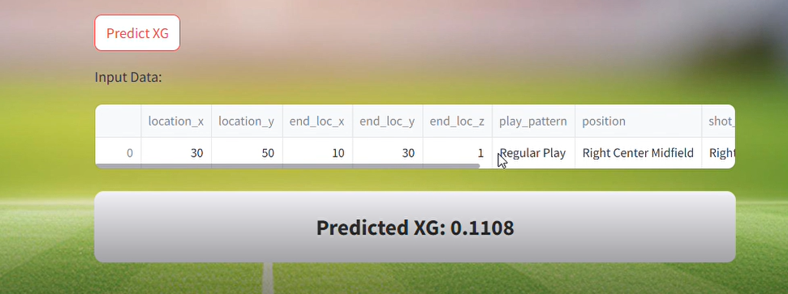

# 📊 Women’s World Cup 2019 – Dashboard & xG Prediction Model


## Project Description

This project is the **second stage** of my Women’s World Cup 2019 analysis.
After building the **Google Colab-based visual analysis**, I developed a **Streamlit dashboard** and added an **Expected Goals (xG) prediction model**.

The goal is to give **clear, accessible insights** into team and player performances, and use machine learning to predict the probability of a shot turning into a goal.

📊 **Data Source:** [StatsBomb Open Data](https://statsbomb.com/)


## Features

**Dashboard Pages**

 **Home**
  
 **Competition Overview** – General tournament stats.
  
  
  
* 📋 **Match-Level Analysis** – Key stats from each match.

  
  
* 👤 **Player Performance** – Passing, shooting, possession metrics.
  
  
  
* **xG Prediction Model**

 -Gradient Boosting algorithm trained on historical match events.
 - Predicts **goal probability** for each shot attempt.

  


## Libraries Used

* `streamlit` – For the dashboard.
* `pandas`, `numpy` – Data manipulation.
* `matplotlib`, `seaborn` – Data visualization.
* `scikit-learn` – Machine learning model training.


## Installation & Execution

**1 Clone the project**

```bash
git clone https://github.com/nadammar/WomensWC2019_Dashboard.git
cd WomensWC2019_Dashboard
```

### 2 Install dependencies

```bash
pip install -r requirements.txt
```


## 3 Running the App

```bash
streamlit run main_app.py 
```


## 🎥 Video Demo

📌 Full dashboard walkthrough available on **LinkedIn** → \[Video Link]


## 👨‍💻 Author

Developed by **Nada Ammar** , passionate football player & data science enthusiast.

